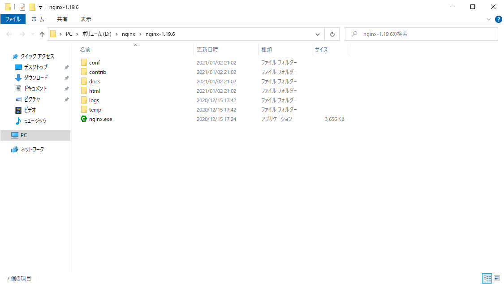
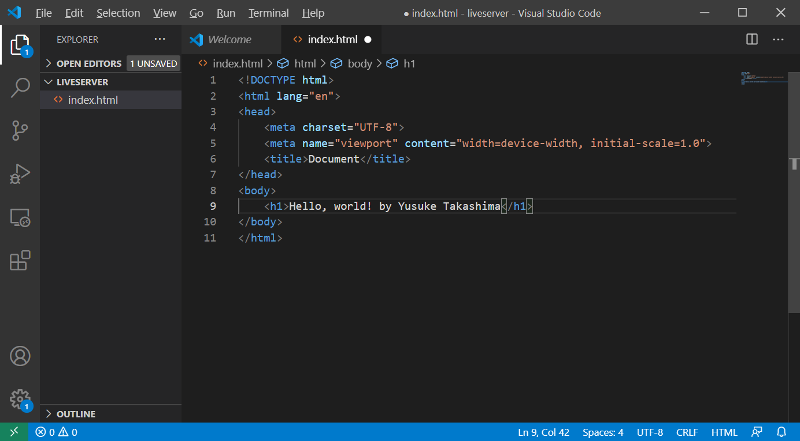
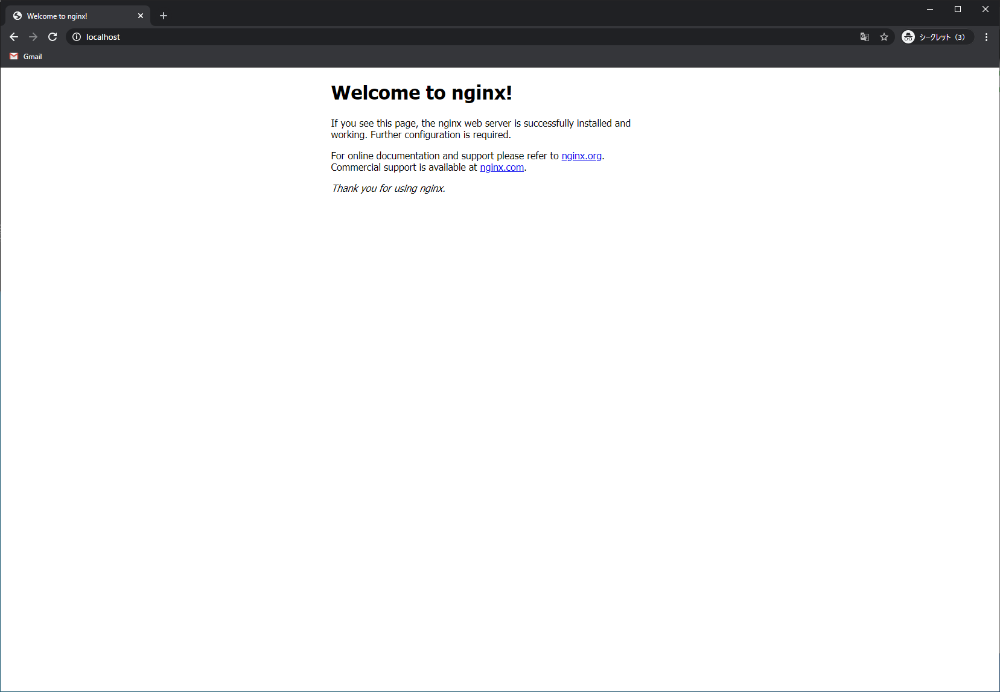

# 今回の目的
Nginxを通じてWebサーバを学ぶ。

# 今回の目標
Nginxを起動し、VSCodeのLiveServerで立てたサーバにリクエストを受け流すように設定する。

# 事前準備
- 1. Nginxのダウンロード・解凍 (インストールは必要ありません。)
- 2. DNSにホスト名を登録

1. ダウンロード・解凍  
http://nginx.org/en/download.html  
こちらからStable(推奨)もしくはMainline versionのzipをダウンロードします。  

 
任意のフォルダに解凍します。  
  
ここでは `D:\nginx` に解凍しました。  

2. DNSにホスト名を登録します。  
※既に登録済みの場合、新たに登録する必要はありません。  

# 本編
## 目次
1. VSCodeでサーバを立てる
2. Nginxを起動する
3. NginxがWebサーバとなるように設定を変更する
4. 技術的説明

## 1. VSCodeでサーバを立てる
適当なところにLiveServer用のフォルダを作成します。  
  
VSCodeを起動し、 `File > Open Folder` を選択して作成したフォルダを開きます。  

`New File` をクリックします。  


`index.html` と入力・エンターし、HTMLファイルを作成します。  


`html5` と入力し、サジェストを選択します。  


bodyタグの中で `h1` と入力し、サジェストを選択します。  


h1タグの中にオリジナルのメッセージを入力します。


`index.html` を右クリックし、 `Open with Live Server` をクリックします。


Live Serverが立ち上がり、入力したメッセージが含まれるページが表示されます。  


何も設定を変更していなければ、 `http://127.0.0.1:5500/index.html` というURLになっているはずです。  

## 2. Nginxを起動する
コマンドプロンプトを立ち上げ、先程解凍したNginxのファイルがあるフォルダに移動します。
```
D:\>cd nginx\nginx-1.19.6
```
こんな感じになります。  
移動できたら、以下のコマンド入力してNginxを起動します。
```
start nginx
```
上のフォルダに合わせると、このようになります。   
```
D:\nginx\nginx-1.19.6>start nginx
```
これで起動は完了です。  
http://localhost  
にアクセスすると、このような画面が表示されます。


また、事前準備で設定したDNSでホスト名を解決する形でアクセスすることもできます。  
```
http://{ホスト名}
```
例えば、http://takashima-yu.hogehoge.com/ にアクセスするとNginxのページが表示されます。  

## 3. NginxがWebサーバとなるように設定を変更する
解凍したnginxのファイルがあるフォルダの中の、 `\conf\nginx.conf` を何らかのエディタで開きます。


`location /` となっている部分
```
        location / {
            root   html;
            index  index.html index.htm;
        }
```
を、以下の様に書き換えます。
```
        location / {
            proxy_pass http://localhost:5500;
        }
```
こうすることで、Nginxに来たHTTPリクエストを、 `localhost:5500` へ 受け流すことが可能です。  
なので、
```
nginx -s reload
```
を実行して設定を読み込み直した上で
```
http://{ホスト名}/index.html
```
にアクセスすると、

このように、 **Live Serverで起動したサーバにアクセスすることができます。**

## 4. 技術的解説
HTTPリクエストを送信すると、ポートを指定しないかぎり、80番ポートへ向けてリクエストが送信されます。  
逆に言うと、ブラウザから送信する `http://localhost` というリクエストは `http://localhost:80` の `:80` を省略しているわけです。  

一方Nginxでは、その設定ファイルである `nginx.conf` で以下の様に設定されています。
```
    server {
        listen       80;
```
これは、 **80番ポートに来たHTTPリクエストをNginxで受け取る** を意味します。  
また、
```
        location / {
            proxy_pass http://localhost:5500;
        }
```
この設定によって、 **80番ポートで受け取ったHTTPリクエストを5500番に流す** ということを行っています。  

これによって、 `http://{ホスト名}/index.html` へのリクエストは5500番で待っているLive Serverのサーバで処理される、というわけです。
このように実際の処理を行うサーバの前でHTTPリクエストを受け付けるサーバのことを、 **Webサーバ** と呼びます。  

図にするとこのようになります。


Webサーバを利用するメリットはいくつもありますが、その内の最も重要なものは処理を行う **APサーバをスケールさせることができる** ことです。  
Webサーバに来たリクエストをランダムに複数あるAPサーバのどれかに振り分けることで、負荷を分散させることが可能です。  
このように、一台のWebサーバから複数のAPサーバへ振り分けられるようになっているWebサーバを **リバースプロキシ** サーバと呼びます。

